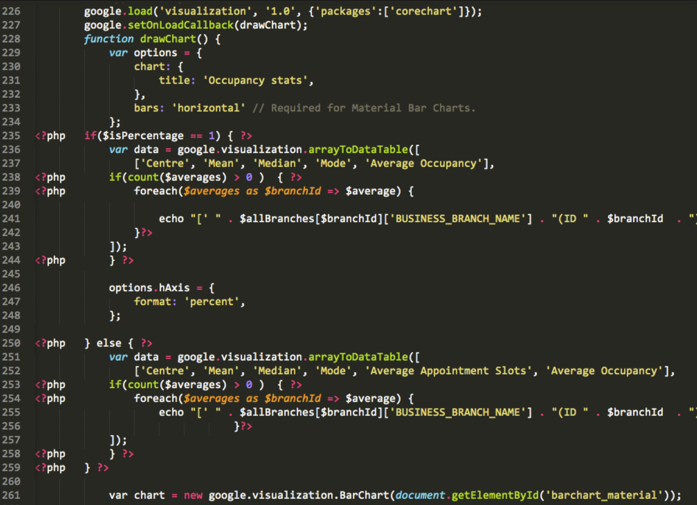
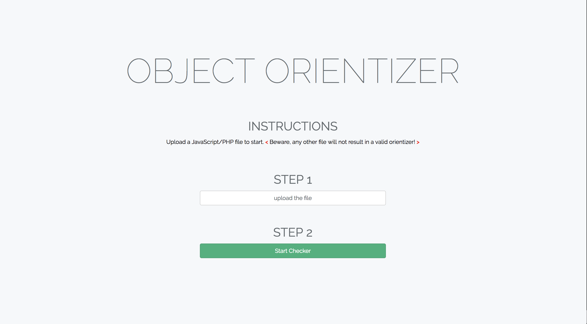
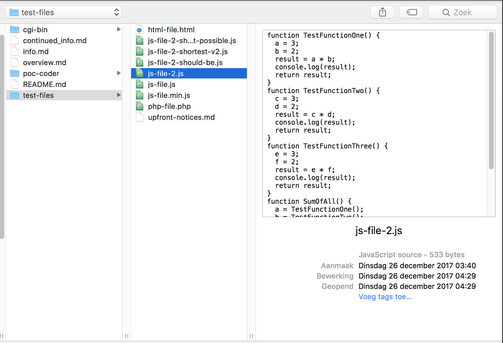
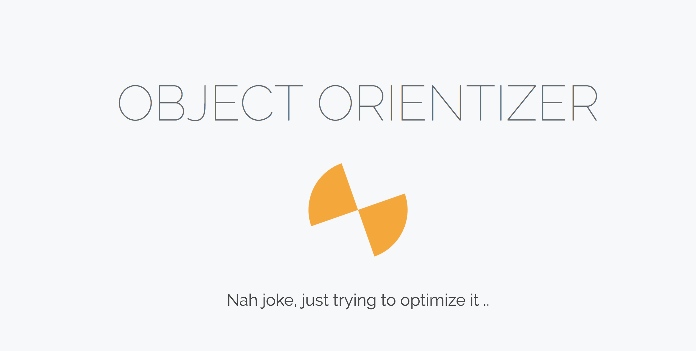
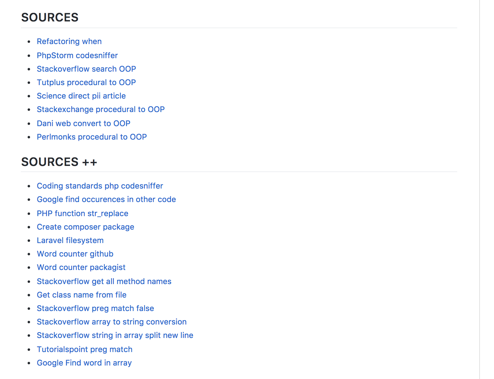
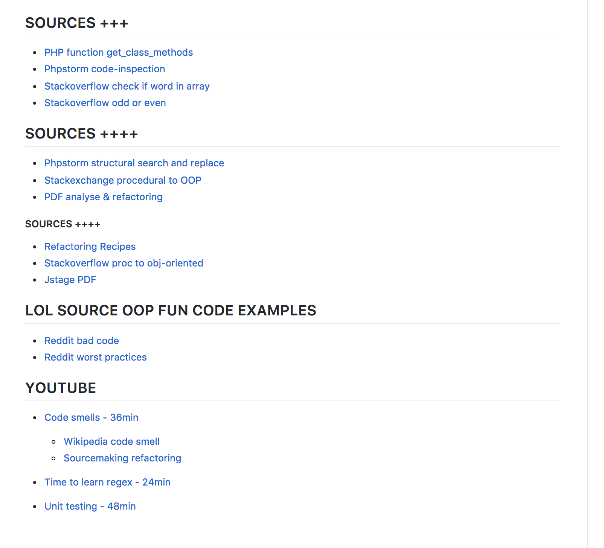

<!-- $theme: gaia -->

# OBJECT-ORIENTIZER Robbert Luit

---

# Intro 

1. Intentions
2. Progress
3. Issues
4. Accomplished result

---

---

# 1. Intentions

---

# Intentions
- Bad code -> Clean code

- OOP from structural 

---

# 2. Progress

---

# Progress
- STEP A - Fileupload 

---

# Progress
-  STEP B - Filetype PHP/JS

---

# Progress
- STEP C - Try optimizing 

---

# 3. Issues

---

# Issues
- Damn this is hard

- Puzzles to solve

- No continuous answer flow (overal iets anders)

---

# Issues
- So many resources..

--- 

# Issues
- What do I use?

---

# Accomplished result

---

# Accomplished result

- Mix from many resources
- Optimization proposals, adhv the uploaded file
- ..

---

# Mmhmhm.. Time for a DEMO [Let's GO!](object-orientizer.robbertluit.be)

    